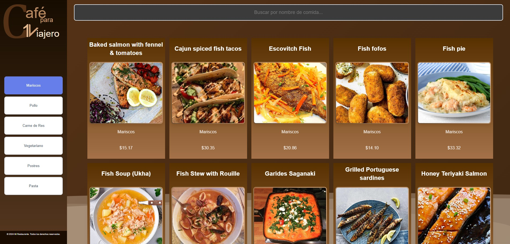

# 🍽️ My Restaurant

**My Restaurant** is a web application built with **React + Vite** that displays a restaurant’s menu in a modern and interactive way.  
The project is designed to practice the use of components, hooks, and modular styles in React.



---

## 🧾 Description

This application shows various restaurant dishes organized by categories.  
Each dish is displayed on a card containing its name, image, description, and price.  
The project structure is divided into reusable and well-organized components.

---

## 🧩 Project Structure

```
src
│ App.css
│ App.jsx
│ index.css
│ main.jsx
│
├───assets
│ react.svg
│
├───component
│ ├───Card
│ │ │ BackgroundCard.css
│ │ │ BackgroundCard.jsx
│ │ │ HeaderCard.css
│ │ │ HeaderCard.jsx
│ │ │ ImageCard.css
│ │ │ ImageCard.jsx
│ │ │ InfoCard.css
│ │ │ InfoCard.jsx
│ │ └───info
│ │ CategoryCard.css
│ │ CategoryCard.jsx
│ │ PriceCard.css
│ │ PriceCard.jsx
│ │
│ ├───main
│ │ PanelMain.css
│ │ PanelMain.jsx
│ │ ResultsSearch.css
│ │ ResultsSearch.jsx
│ │
│ └───web
│ │ WebMenu.css
│ │ WebMenu.jsx
│ ├───footer
│ │ Footer.css
│ │ Footer.jsx
│ ├───header
│ │ WebBackHeader.css
│ │ WebBackHeader.jsx
│ └───menu
│ CategorySelec.css
│ CategorySelec.jsx
│
└───hooks
```

## 🍴 Main Menu

This is my main menu — it’s my first time building it this way, so it took me a bit longer, but… WELL, here it is! 😄  


In this section, users can see the company logo and interact by switching categories.  
⚠️<span style="color:red">**In future updates, they will even be able to search by price!**</span>⚠️

---

## ⚙️ Installation and Execution

1. Clone this repository:
   ```bash
   git clone https://github.com/Adrianbien43/AdrianBien-restaurante.git